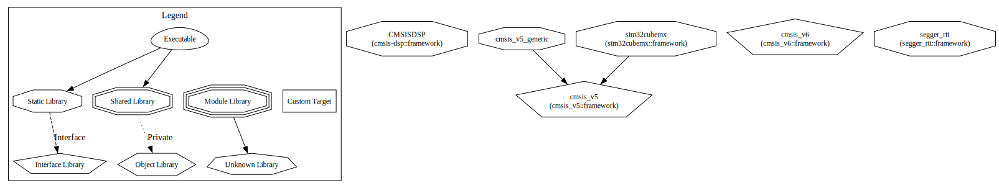

# Kodezine's CMake Collection
This is a comprehensive collection of CMake scripts for embedded systems developement.
Each folder in this repository contains a markdown file that helps in making sense. I hope it does.

[Static Libraries](./.readme/Debug.svg) 
## Minimum CMake version
While care has been taken to make the CMake scripts as modern as possible.

## [frameworks](./frameworks/)
This folder contains different frameworks like:
* [cmsis_v5](https://arm-software.github.io/CMSIS_5/General/html/index.html)
* [cmsis_v6](https://github.com/ARM-software/CMSIS_6)
* [cmsis-dsp](https://github.com/ARM-software/CMSIS-DSP)
* [unity](http://www.throwtheswitch.org/unity)
* [cmock](http://www.throwtheswitch.org/cmock)
* [segger_rtt](https://wiki.segger.com/RTT)
and many more...

## [silicon](./silicon/)
This folder contains various silicon vendor libraries creation scripts
* STMicroelectronics
    * [stm32cubemx](https://github.com/STMicroelectronics/STM32Cube_MCU_Overall_Offer)
... others follow.

## [toolchains](./toolchains/toolchains.md)
Cross compilation toolchains which can use CMake.

## [utilities](./utilities/)

